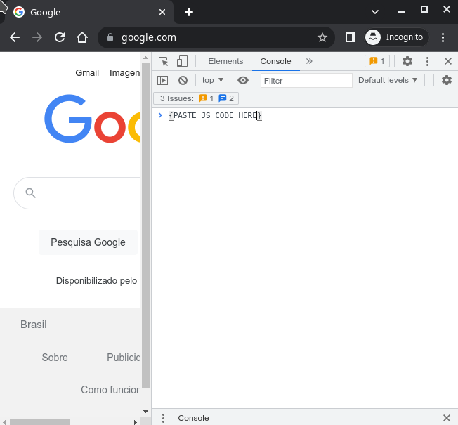
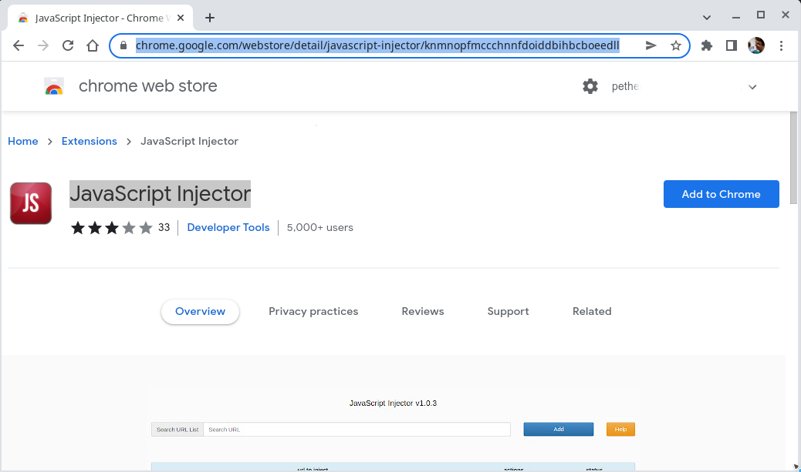
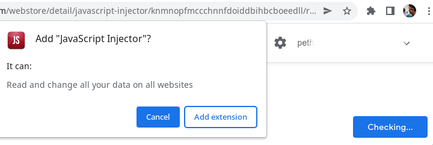
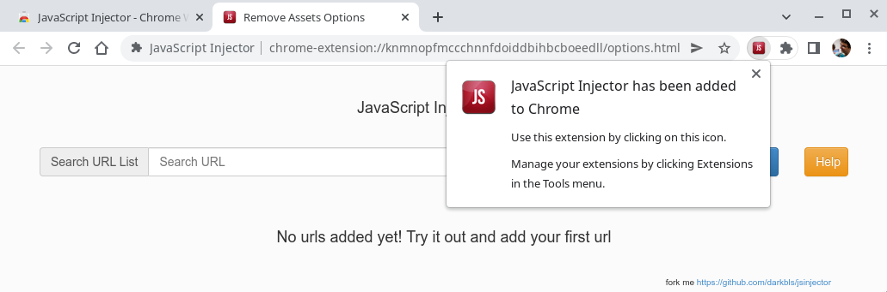
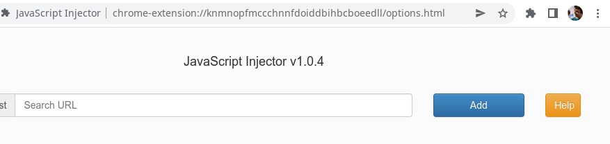
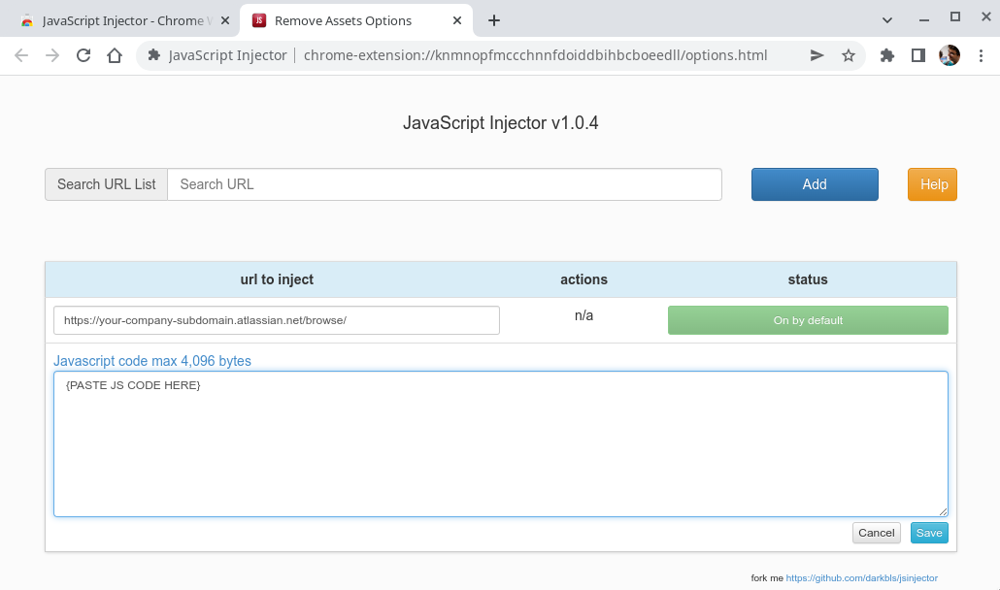
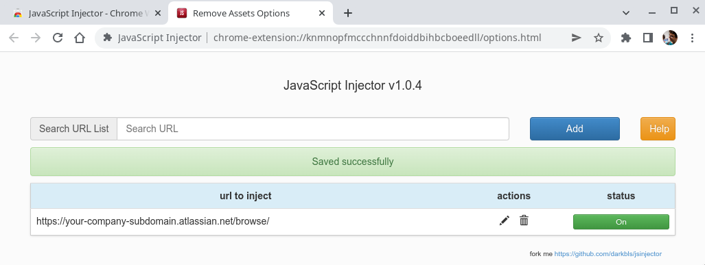

# jira-scripts-to-style-updates
Scripts to update style of Jira, it can be used to update a page of card to read with more space in the screen and with higher font size :)


## Javascript to run to use Prepare Page to Read Card

```javascript
const runScript = async (url) => {
  return new Promise((resolve, reject) => {
    const script = document.createElement("script");
    script.onload = resolve;
    script.onerror = reject;
    script.setAttribute("type", "application/javascript");
    fetch(url).then(resp => resp.text()).then(jsContent => {
        script.innerHTML = jsContent;
        document.body.appendChild(script);
    });
  });
};
// Configure the font-size you want apply changing this value 1.8em
window.fontSizeAkRendererDocument = "1.8em";
// Configure the font-size you want apply changing this value 18px
window.fontSizeIssueLineCardElementAnchor = "18px";
runScript("https://raw.githubusercontent.com/pethersonmoreno/jira-scripts-to-style-updates/main/prepare-page-to-read-card.js")
```

## Running directly on Chrome Console

First of all, you have to open Chrome and use the shortcut F12 (in Linux), and then open console tab:



As showed in the image where is the text `{PASTE JS CODE HERE}` you paste the code in the section `Javascript to run to use Prepare Page to Read Card`, an then press Enter.

Remember that you can customize the font size applied updating the values:

 - `window.fontSizeAkRendererDocument`
 - `window.fontSizeIssueLineCardElementAnchor`

## Configuring it on JavaScript Injector Chrome extension

You need install the extension, to do it, open the Chrome browser at URL:

 - [https://chrome.google.com/webstore/detail/javascript-injector/knmnopfmccchnnfdoiddbihbcboeedll](https://chrome.google.com/webstore/detail/javascript-injector/knmnopfmccchnnfdoiddbihbcboeedll)



Then install the extension, by clicking at the "add to chrome" button. And confirming in the confirmation dialog window:



By clicking at "Add extension" button will open JavaScript Injector Chrome extension settings:



Then after close initial notification:



By clicking at "Add" button will open show form to configure a new injection:



As showed in the image in "Target URL" field you put a value like `https://your-company-subdomain.atlassian.net/browse/` where `your-company-subdomain` is the subdomain of your company to access Jira.

Where is the text `{PASTE JS CODE HERE}` you paste the code in the section `Javascript to run to use Prepare Page to Read Card`.

And then click at save button, and then you will see injection registered:



Now you have the Javascript Injection configured, by clicking at <span style="color:green">"On" green button</span> you can disable the injection, and clicking at <span style="color:red">"Off" red button</span> you can enable back the injection.
