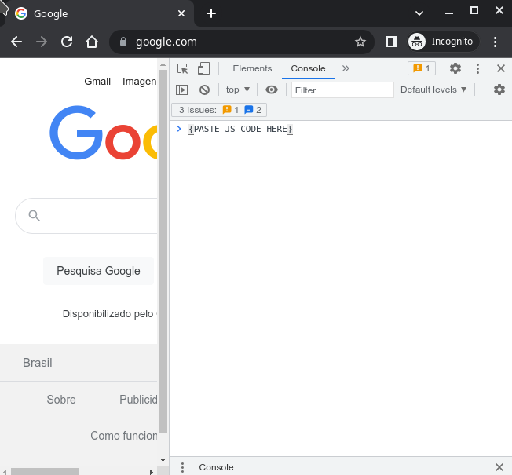

# jira-scripts-to-style-updates
Scripts to update style of Jira, it can be used to update a page of card to read with more space in the screen and with higher font size :)


## Javascript to run to use Prepare Page to Read Card

```javascript
const runScript = async (url) => {
  return new Promise((resolve, reject) => {
    const script = document.createElement("script");
    script.onload = resolve;
    script.onerror = reject;
    script.setAttribute("type", "application/javascript");
    fetch(url).then(resp => resp.text()).then(jsContent => {
        script.innerHTML = jsContent;
        document.body.appendChild(script);
    });
  });
};
// Configure the number of retries that is tried waiting 500 ms between each trying changing this value 20
window.defaultRetriesToPreparePageToReadCard = 20;
// Configure the font-size you want apply changing this value 1.8em
window.fontSizeAkRendererDocument = "1.8em";
// Configure the font-size you want apply changing this value 18px
window.fontSizeIssueLineCardElementAnchor = "18px";
runScript("https://raw.githubusercontent.com/pethersonmoreno/jira-scripts-to-style-updates/1.0/prepare-page-to-read-card.js")
```

## Javascript to run to add keyboard navigation on the document to read

List of Keyboard commands added:

- Home -> scroll at the top of the card
- End -> scroll at the bottom of the card
- Arrow Up -> scroll up 50 pixels
- Shift + Arrow Up -> scroll up 100 pixels
- Ctrl + Arrow Up -> scroll up 150 pixels
- Ctrl + Shift + Arrow Up -> scroll up 200 pixels
- Alt + Arrow Up -> scroll up 400 pixels
- Arrow Down -> scroll down 50 pixels
- Shift + Arrow Down -> scroll down 100 pixels
- Ctrl + Arrow Down -> scroll down 150 pixels
- Ctrl + Shift + Arrow Down -> scroll down 200 pixels
- Alt + Arrow Down -> scroll down 400 pixels

```javascript
const keycodeHome = 36;
const keycodeEnd = 35;
const keycodeUpArrow = 38;
const keycodeDownArrow = 40;
const stepOneTimeInPixels = 50;
const stepTwoTimesInPixels = 100;
const stepThreeTimesInPixels = 150;
const stepFourTimesInPixels = 200;
const stepEightTimesInPixels = 400;
const getJiraCardElement = () => document.body.querySelector("#jira-issue-header").parentElement.parentElement;
const getJiraCardElementMaxScrollValue = () => document.body.querySelector("#jira-issue-header").parentElement.offsetHeight;
const scrollJiraCard = (pixels) => {
  let newScrollTop = getJiraCardElement().scrollTop+pixels;
  if (newScrollTop < 0) {
    newScrollTop = 0;
  }
  getJiraCardElement().scrollTop=newScrollTop
};
document.body.addEventListener("keyup", function(e) {
  console.log(e.which)
  if (e.which == keycodeHome) {
    getJiraCardElement().scrollTop=0;
  }
  if (e.which == keycodeEnd) {
    getJiraCardElement().scrollTop=getJiraCardElementMaxScrollValue();
  }
  if (e.which != keycodeUpArrow && e.which != keycodeDownArrow){
    return;
  }
  let stepInPixels = stepOneTimeInPixels;
  if (e.shiftKey && !e.ctrlKey && !e.altKey) {
    stepInPixels = stepTwoTimesInPixels;
  } else if (!e.shiftKey && e.ctrlKey && !e.altKey) {
    stepInPixels = stepThreeTimesInPixels;
  } else if (e.shiftKey && e.ctrlKey && !e.altKey) {
    stepInPixels = stepFourTimesInPixels;
  } else if (!e.shiftKey && !e.ctrlKey && e.altKey) {
    stepInPixels = stepEightTimesInPixels;
  }
  const stepInPixelsWithDirection = (e.which == keycodeUpArrow?-stepInPixels:stepInPixels);
  scrollJiraCard(stepInPixelsWithDirection);
});
```

## Running directly on Chrome Console

First of all, you have to open Chrome and use the shortcut F12 (in Linux), and then open console tab:



As showed in the image where is the text `{PASTE JS CODE HERE}` you paste the code in the section `Javascript to run to use Prepare Page to Read Card`, an then press Enter.

Remember that you can customize the font size applied updating the values:

 - `window.fontSizeAkRendererDocument`
 - `window.fontSizeIssueLineCardElementAnchor`